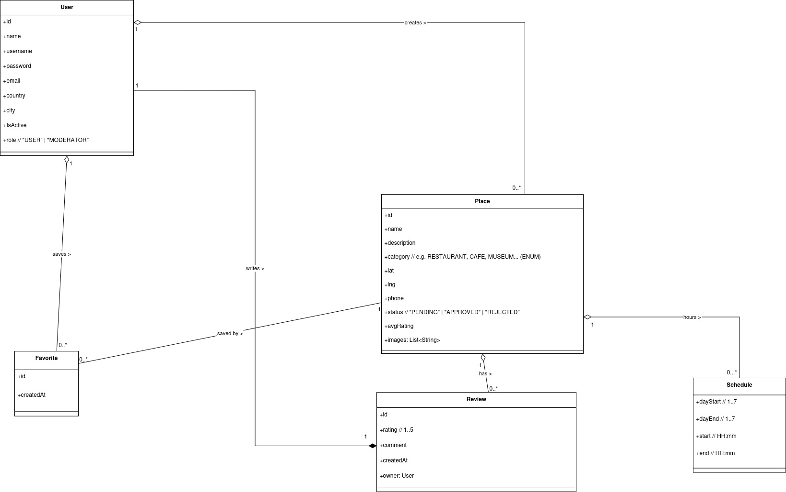

<h1 align="center">UniLocal Mobile App</h1>

  

  <b>Aplicación móvil que promueve el comercio local y la gastronomía regional</b> 
  Descubre, comparte y califica los mejores lugares en tu ciudad

<h2>
  
  Descripción general
</h2>

  <b>UniLocal</b> es una aplicación móvil que promueve el comercio local y la gastronomía regional al ayudar a los usuarios a descubrir lugares cercanos como restaurantes, cafeterías, sitios de comida rápida, museos y hoteles.

  La app ofrece un <b>mapa interactivo</b>, búsqueda y filtros por nombre, categoría o distancia, así como la posibilidad de dejar calificaciones y comentarios.  
  Solo los usuarios registrados pueden crear nuevos lugares y participar en la comunidad, mientras que un equipo de moderadores revisa y aprueba los envíos para garantizar la calidad y autenticidad del contenido.

Entre sus principales funcionalidades se incluyen:

<ul>
  <li> Geolocalización en tiempo real</li>
  <li> Carga de imágenes</li>
  <li> Contenido generado por usuarios</li>
  <li> Filtros avanzados de búsqueda</li>
</ul>

<h2>
   Equipo del proyecto
</h2>

<table>
  <tr>
    <th>Nombre</th>
    <th>Código</th>
  </tr>
  <tr>
    <td><b>David Mantilla Avilés</b></td>
    <td>240220212015</td>
  </tr>
  <tr>
    <td><b>Mariana Osorio Hernández</b></td>
    <td>24020211026</td>
  </tr>
  <tr>
    <td><b>Jhovanny Quiceno</b></td>
    <td>240220221047</td>
  </tr>
</table>

<h2>
  
  Tech Stack
</h2>

<table align="center">
  <tr>
    <td align="center" width="200">
       
      <b>Kotlin</b> 
      <small>v2.2.0</small>
    </td>
    <td align="center" width="200">
       
      <b>Jetpack Compose</b> 
      <small>v1.11.0 (Activity Compose)</small>
    </td>
    <td align="center" width="200">
       
      <b>Android Studio</b> 
      <small>AGP 8.13.0</small>
    </td>
  </tr>
</table>

<i>Dependencias adicionales:</i>

<table>
  <tr>
    <th>Dependencia</th>
    <th>Versión</th>
  </tr>
  <tr><td>Core KTX</td><td>1.17.0</td></tr>
  <tr><td>JUnit (unit tests)</td><td>4.13.2</td></tr>
  <tr><td>JUnit (AndroidX)</td><td>1.3.0</td></tr>
  <tr><td>Espresso Core (UI tests)</td><td>3.7.0</td></tr>
  <tr><td>Lifecycle Runtime KTX</td><td>2.9.3</td></tr>
  <tr><td>Compose BOM</td><td>2024.09.00</td></tr>
  <tr><td>Navigation Compose</td><td>2.9.1</td></tr>
  <tr><td>Kotlinx Serialization</td><td>1.9.0</td></tr>
</table>

<h2>
  
  Características principales
</h2>

<ul>
  <li> <b>Mapa interactivo</b> para ubicar restaurantes, hoteles, museos y más.</li>
  <li> <b>Búsqueda y filtros</b> por nombre, categoría y distancia.</li>
  <li> <b>Sistema de calificaciones y comentarios</b>.</li>
  <li> <b>Gestión de contenido generado por usuarios</b> con revisión de moderadores.</li>
  <li> <b>Subida de imágenes</b> para cada lugar.</li>
  <li> <b>Soporte de ubicación en tiempo real</b>.</li>
</ul>

<h2>
  
  Estructura del proyecto
</h2>

<pre>
unilocal/
├── app/
│   ├── ui/
│   ├── data/
│   ├── model/
│   ├── viewmodel/
│   └── navigation/
├── assets/
│   └── unilocal.jpg
└── README.md
</pre>

<h2>
  
  Filosofía de diseño
</h2>

  UniLocal promueve la idea de una comunidad que <b>valora lo local</b>, integrando tecnología moderna con valores sociales.  
  Cada componente fue desarrollado siguiendo principios de:

<ul>
  <li><b>Simplicidad</b> en la interfaz.</li>
  <li><b>Escalabilidad</b> en la arquitectura.</li>
  <li><b>Accesibilidad</b> en la experiencia de usuario.</li>
</ul>

<h2>
  
  Licencia
</h2>

  Este proyecto fue desarrollado con fines académicos por estudiantes del programa de Ingeniería de Software.  
  Puedes usarlo y modificarlo libremente para fines educativos o demostrativos.

  
  <b>Hecho con ❤️ usando Kotlin + Jetpack Compose</b>

